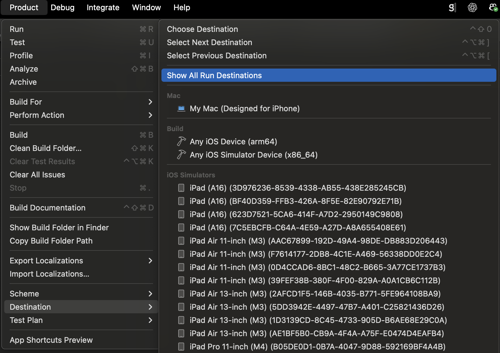
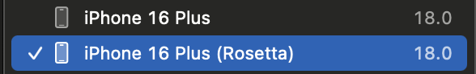

# RudderStack React Native SDK - Expo Example App

This is a comprehensive Expo React Native sample application demonstrating the integration of **RudderStack React Native SDK** with multiple RudderStack integrations for analytics and marketing platforms.

## Overview

This example app showcases how to implement RudderStack's customer data platform capabilities in an Expo React Native application, featuring multiple destination integrations and advanced SDK features like database encryption, session management, and opt-out controls.

## Supported RudderStack Integrations

This Expo app supports **9 major RudderStack integrations**:

1. **[Rudder Amplitude](https://www.rudderstack.com/docs/destinations/streaming-destinations/amplitude/device-mode/)** - Product analytics platform
2. **[Rudder AppCenter](https://www.rudderstack.com/docs/destinations/streaming-destinations/appcenter/)** - Mobile app analytics and crash reporting
3. **[Rudder AppsFlyer](https://www.rudderstack.com/docs/destinations/streaming-destinations/appsflyer/)** - Mobile attribution and marketing analytics
4. **[Rudder Braze](https://www.rudderstack.com/docs/destinations/streaming-destinations/braze/device-mode/)** - Customer engagement platform
5. **[Rudder CleverTap](https://www.rudderstack.com/docs/destinations/streaming-destinations/clevertap/)** - Mobile marketing and engagement platform
6. **[Rudder Facebook App Events](https://www.rudderstack.com/docs/destinations/streaming-destinations/facebook-app-events/)** - Meta's analytics platform
7. **[Rudder Firebase](https://www.rudderstack.com/docs/destinations/streaming-destinations/firebase/)** - Google's app analytics
8. **[Rudder MoEngage](https://www.rudderstack.com/docs/destinations/streaming-destinations/moengage/)** - Customer engagement platform
9. **[Rudder Singular](https://www.rudderstack.com/docs/destinations/streaming-destinations/singular/device-mode/)** - Mobile attribution and marketing analytics

## Prerequisites

- **Node.js** (v16 or higher)
- **Expo CLI** (`npm install -g @expo/cli`)
- **React Native development environment**
- **Android Studio** (for Android development)
- **Xcode** (for iOS development - macOS only)

## Installation

1. **Clone the repository** (if not already done):

   ```bash
   git clone <repository-url>
   cd rudder-sdk-react-native/apps/expo-example
   ```

2. **Install dependencies**:

   ```bash
   npm install
   ```

3. **Create environment file**:
   Create a `.env` file in the root directory:
   ```env
   WRITE_KEY=your_rudderstack_write_key
   DATA_PLANE_URL=your_data_plane_url
   ```

## Platform-Specific Setup

### Android Configuration

1. **Update `android/build.gradle`** - Add repository for Singular:

   ```gradle
   allprojects {
       repositories {
           maven { url 'https://maven.singular.net/' }
       }
   }
   ```

2. **Update minimum SDK version** to 25 in your Android configuration

3. (Optional) **Add SQLCipher dependencies** in `app/build.gradle`:
   ```gradle
   implementation "net.zetetic:sqlcipher-android:4.5.6@aar"
   implementation "androidx.sqlite:sqlite:2.3.1"
   ```

### iOS Configuration

1. **Add to `Podfile`**:

   ```ruby
   # Firebase iOS setup
   pod 'FirebaseCore', :modular_headers => true
   pod 'GoogleUtilities', :modular_headers => true

   # CleverTap fix
   pod 'Rudder-CleverTap', '1.1.2'
   ```

2. **Run pod install**:
   ```bash
   cd ios && pod install
   ```

## Running the App

### Development Server

```bash
npm run start
# or
expo start --dev-client
```

### Platform-Specific Commands

```bash
# iOS
npm run ios
# or
expo run:ios

# Android
npm run android
# or
expo run:android
```

### Alternative: Running iOS App Through Xcode

To run the project directly in Xcode:

1. **Open the workspace**:

   ```bash
   open ios/expoexample.xcworkspace
   ```

2. **Configure the simulator**:

   - Navigate to **Xcode → Product → Destinations → Show All Run Destinations**

   

3. **Select Rosetta Simulator** (required for compatibility):

   

4. **Build and run**:
   - Click the **Run** button (▶️) in Xcode
   - The app will build and launch on the selected simulator

## Features Demonstrated

This example app demonstrates the following RudderStack SDK capabilities:

### Core Tracking Methods

- **Identify** - Identify users with traits
- **Track** - Track custom events
- **Screen** - Track screen views
- **Group** - Associate users with groups
- **Alias** - Link user identities

### Advanced Features

- **Database Encryption** - Secure local data storage
- **Session Management** - Manual session control
- **External ID Support** - Link with external systems (e.g., Braze)
- **Opt-out Controls** - Privacy compliance
- **Advertising ID Management** - Handle platform advertising IDs
- **Context Retrieval** - Access RudderStack context data
- **Integration Controls** - Enable/disable specific destinations

### Integration-Specific Features

- **AppsFlyer** - Attribution callbacks and custom domains
- **AppCenter** - Analytics enable/disable controls
- **Braze** - External ID integration

## Environment Configuration

The app uses environment variables for configuration. Update your `.env` file with:

```env
# RudderStack Configuration
WRITE_KEY=your_write_key_here
DATA_PLANE_URL=https://your-data-plane-url.com

# Integration-Specific Keys (if needed)
APPSFLYER_DEV_KEY=your_appsflyer_dev_key
APPSFLYER_APPLE_ID=your_apple_app_id
```

## Testing the Integration

1. **Launch the app** on your preferred platform
2. **Use the UI buttons** to trigger different RudderStack methods
3. **Check console logs** for method execution confirmations
4. **Verify in RudderStack dashboard** that events are being received
5. **Check destination platforms** to confirm data delivery

## Integration Configuration

To enable specific integrations:

1. **Uncomment the desired integration** in `RudderStackAPIs.js` in the `withFactories` array
2. **Configure destination settings** in your RudderStack dashboard
3. **Add platform-specific configuration** as mentioned in the setup sections

## Troubleshooting

### Common Issues

- **Build failures**: Ensure all platform-specific configurations are applied
- **Network errors**: Check `DATA_PLANE_URL` and network connectivity
- **Integration not receiving data**: Verify destination configuration in RudderStack dashboard
- **iOS build issues**: Ensure pods are installed and Kotlin version is updated
- **Android SQLCipher errors**: Verify SQLCipher dependencies are added

### Android Emulator: "Failed to connect to localhost" Error

If the Expo Dev Client shows "Failed to connect to localhost/127.0.0.1:8081" when trying to connect to Metro bundler, you need to set up port forwarding. The Android emulator runs in its own network namespace where `localhost` refers to the emulator itself, not your host machine.

Run this command to forward port 8081 from the emulator to your host:

```bash
adb reverse tcp:8081 tcp:8081
```

After running this command, enter `http://localhost:8081` in the URL field and tap "Connect" in the Expo Dev Client to connect to Metro.

### Debug Mode

The app is configured with verbose logging. Check your development console for detailed SDK operation logs.

## Documentation

- [RudderStack React Native SDK Documentation](https://rudderstack.com/docs/sources/event-streams/sdks/rudderstack-react-native-sdk/)
- [RudderStack Destination Guides](https://rudderstack.com/docs/destinations/)
- [Expo Documentation](https://docs.expo.dev/)

## Support

For issues related to:

- **RudderStack SDK**: [RudderStack Support](https://rudderstack.com/contact/)
- **Expo**: [Expo Community](https://expo.dev/community)
