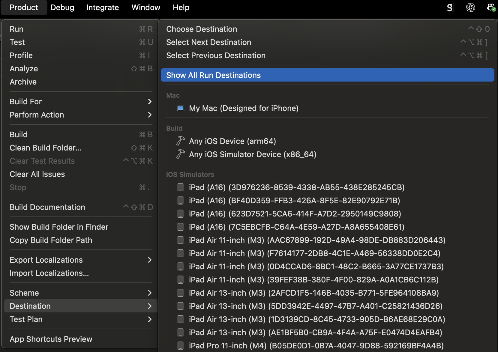
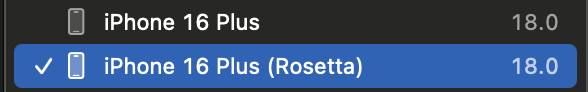

# RudderStack React Native SDK - Expo Example App

This is an Expo React Native sample application demonstrating the integration of **RudderStack React Native SDK** with Firebase Analytics integration.

## Overview

This example app showcases how to implement RudderStack's customer data platform capabilities in an Expo React Native application, featuring Firebase Analytics integration and core SDK features.

## Supported RudderStack Integration

This Expo app demonstrates integration with:

1. **[Rudder Firebase](https://www.rudderstack.com/docs/destinations/streaming-destinations/firebase/)** - Google's Firebase Analytics platform

## Prerequisites

- **Node.js** (v16 or higher)
- **Expo CLI** (`npm install -g @expo/cli`)
- **React Native development environment**
- **Android Studio** (for Android development)
- **Xcode** (for iOS development - macOS only)

## Installation

1. **Clone the repository** (if not already done):

   ```bash
   git clone <repository-url>
   cd rudder-sdk-react-native/apps/expo-example
   ```

2. **Install dependencies**:

   ```bash
   npm install
   ```

3. **Create environment file**:
   Create a `.env` file in the root directory:
   ```env
   WRITE_KEY=your_rudderstack_write_key
   DATA_PLANE_URL=your_data_plane_url
   ```

## Platform-Specific Setup

### Android Configuration

1. **Add Firebase configuration file**:
   - Place your `google-services.json` file in the `android/app/` directory
   - This file is required for Firebase Analytics integration

### iOS Configuration

1. **Add Firebase configuration file**:
   - Place your `GoogleService-Info.plist` file in the `ios/` directory
   - This file is required for Firebase Analytics integration

2. **Firebase dependencies are already configured** in the `Podfile`:

   ```ruby
   # Firebase iOS setup
   pod 'FirebaseCore', :modular_headers => true
   pod 'GoogleUtilities', :modular_headers => true
   $FirebaseSDKVersion = '11.4.0'
   ```

3. **Run pod install**:
   ```bash
   cd ios && pod install
   ```

## Running the App

### Development Server

```bash
npm run start
# or
expo start --dev-client
```

### Platform-Specific Commands

```bash
# iOS
npm run ios
# or
expo run:ios

# Android
npm run android
# or
expo run:android
```

### Alternative: Running iOS App Through Xcode

To run the project directly in Xcode:

1. **Open the workspace**:

   ```bash
   open ios/expoexample.xcworkspace
   ```

2. **Configure the simulator**:

   - Navigate to **Xcode → Product → Destinations → Show All Run Destinations**

   

3. **Select Rosetta Simulator** (required for compatibility):

   

4. **Build and run**:
   - Click the **Run** button (▶️) in Xcode
   - The app will build and launch on the selected simulator

## Features Demonstrated

This example app demonstrates the following RudderStack SDK capabilities:

### Core Tracking Methods

- **Identify** - Identify users with traits
- **Track** - Track custom events
- **Screen** - Track screen views
- **Group** - Associate users with groups
- **Alias** - Link user identities

### Advanced Features

- **Session Management** - Manual session control
- **External ID Support** - Link with external systems
- **Opt-out Controls** - Privacy compliance
- **Advertising ID Management** - Handle platform advertising IDs
- **Context Retrieval** - Access RudderStack context data
- **Integration Controls** - Enable/disable specific destinations

### Integration-Specific Features

- **Firebase Analytics** - Google Analytics integration for mobile apps

## Environment Configuration

The app uses environment variables for configuration. Update your `.env` file with:

```env
# RudderStack Configuration
WRITE_KEY=your_write_key_here
DATA_PLANE_URL=https://your-data-plane-url.com
```

## Testing the Integration

1. **Launch the app** on your preferred platform
2. **Use the UI buttons** to trigger different RudderStack methods
3. **Check console logs** for method execution confirmations
4. **Verify in RudderStack dashboard** that events are being received
5. **Check destination platforms** to confirm data delivery

## Integration Configuration

To configure Firebase Analytics:

1. **Firebase integration is already enabled** in `RudderStackAPIs.js` in the `withFactories` array
2. **Configure Firebase destination** in your RudderStack dashboard
3. **Add Firebase configuration files** as mentioned in the platform-specific setup sections

## Troubleshooting

### Common Issues

- **Build failures**: Ensure all platform-specific configurations are applied
- **Network errors**: Check `DATA_PLANE_URL` and network connectivity
- **Firebase integration not receiving data**: Verify Firebase destination configuration in RudderStack dashboard and ensure Firebase configuration files are properly added
- **iOS build issues**: Ensure pods are installed and Firebase configuration is properly set up
- **Android build issues**: Ensure `google-services.json` is placed in the correct directory

### Debug Mode

The app is configured with verbose logging. Check your development console for detailed SDK operation logs.

## Documentation

- [RudderStack React Native SDK Documentation](https://rudderstack.com/docs/sources/event-streams/sdks/rudderstack-react-native-sdk/)
- [RudderStack Destination Guides](https://rudderstack.com/docs/destinations/)
- [Expo Documentation](https://docs.expo.dev/)

## Support

For issues related to:

- **RudderStack SDK**: [RudderStack Support](https://rudderstack.com/contact/)
- **Expo**: [Expo Community](https://expo.dev/community)
